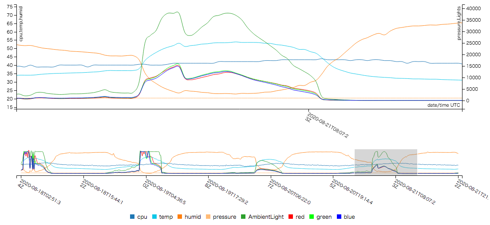

# his.RASP.i2c abstruct
* Python scrips for i2c sensors on Raspberry Pi
* script for convert from "test formated log file" to "JSON format"
* https:/c3.js.org based JavaScript for display line chart

# 概要
1. Rapberry piにi2cでアクセス可能なセンサを接続する。
1. cronで定期的に起動するスクリプトでセンサ情報を取得し、テキスト形式のログファイルに出力する。
1. 出力されたファイルをJSON形式に変換する。
1. https://c3js.org/ で可視化する。
 
# 1.センサ接続
## 1.1 対象センサ
* APDS9960使用 光学式ジェスチャーセンサモジュールキット
   http://akizukidenshi.com/catalog/g/gK-09754/
* BME280使用　温湿度・気圧センサモジュールキット
   http://akizukidenshi.com/catalog/g/gK-09421/
   
## 1.2 接続概要図
    ラズパイ4Bは、放熱のためにアルミ合金ケースに入れているが、GPIO(40pin)はフラットケーブルで
    ケース外に引き出すことができる。
    そこからブレッドボードに繋いでセンサモジュールを接続してみた。
<p align="center">
	
</p>

## 1.3 接続確認
```
# apt install i2c-tools
# i2cdetect -y 1

         0  1  2  3  4  5  6  7  8  9  a  b  c  d  e  f
    00:          -- -- -- -- -- -- -- -- -- -- -- -- --
    10: -- -- -- -- -- -- -- -- -- -- -- -- -- -- -- --
    20: -- -- -- -- -- -- -- -- -- -- -- -- -- -- -- --
    30: -- -- -- -- -- -- -- -- -- 39 -- -- -- -- -- --
    40: -- -- -- -- -- -- -- -- -- -- -- -- -- -- -- --
    50: -- -- -- -- -- -- -- -- -- -- -- -- -- -- -- --
    60: -- -- -- -- -- -- -- -- -- -- -- -- -- -- -- --
    70: -- -- -- -- -- -- 76 --              
```

* 0x39がAPDS9960
* 0x76がBME280

とりあえず、認識されているようだ。

# 2.センサ情報取得
## 2.1 前提ソフトウエアのインストール
```
# apt install python3-smbus python3-pip
# python3 -m pip install apds9960
# python3 -m pip install  RPi.GPIO
```

## 2.2 <a href="./scripts/his.ambient.py">his.ambient.py</a>
光センサからの取得データを標準出力に出して終わる。
```
# python3 ./his.ambient.py 
{ "place" : "home" ,  "time" : "2020-08-22T00:16:01Z" ,  "AmbientLight" : 4398 ,  "red" :1296 ,  "green" :1389 ,  "blue" :1483 }
```

## 2.3 <a href="./scripts/his.env2.py">his.env2.py</a>
環境センサからの取得データを標準出力に出して終わる。
```
# python3 ./his.env2.py 
{ "place": "home" , "time": "2020-08-22T00:13:13Z" , "cpu": 39.0 , "temp": 35.1 , "humid": 49.5 , "pressure": 1012.3 }
```

## 2.4 <a href="./scripts/his.log.wrap.sh">his.log.wrap.sh</a>
２つのセンサ情報をまとめて、本日付の名前のログファイルに出力するスクリプト。<br>
スクリプト内で、上記his.ambient.pyとhis.env2.pyを起動し、出力をマージ・整形している。

## 2.5 cronの設定
10分ごとにhis.log.wrap.shを起動する。
```
# crontab -e
```
で編集する。
```
*/10 * * * * /home/shibata/scripts/his.log.wrap.sh
```

## 2.6 ログファイル例
下記のように、1行ごとに2つのセンサ情報を記録している。<br>
cpu:はRaspberry PiのCPU温度センサの値。

```
{ "place" : "home" , "time" : "2020-08-22T00:00:02Z" , "AmbientLight" : 4057 , "
red" :1156 , "green" :1260 , "blue" :1370  , "cpu": 40.1 , "temp": 35.3 , "humid
": 49.3 , "pressure": 1012.4 }
{ "place" : "home" , "time" : "2020-08-22T00:10:02Z" , "AmbientLight" : 3175 , "
red" :875 , "green" :989 , "blue" :1115  , "cpu": 40.1 , "temp": 35.1 , "humid":
 49.5 , "pressure": 1012.4 }
{ "place" : "home" , "time" : "2020-08-22T00:20:02Z" , "AmbientLight" : 3144 , "
red" :863 , "green" :978 , "blue" :1109  , "cpu": 40.1 , "temp": 35.2 , "humid":
 49.4 , "pressure": 1012.4 }
```

# 3.出力ファイルをJSON形式に変換
## 3.1 <a href="./scripts/log2json.awk">log2json.awk</a>
標準入力のテキストを、単純にJSON形式に変換して標準出力するawkスクリプト。<br>
ファイル形式のチェックは行なっていない。つまり、たいしたことはやってない。

## 3.2 cronの設定
毎時07分に上記スクリプトを起動し、所望の場所にファイル出力する。
```
7 * * * * cat /home/shibata/his.SensorLogs/Log-2*|/home/shibata/scripts/log2json.awk > /var/www/html/Log.txt
```

## 3.3 出力ファイル例
<a href="./html/Log.txt">Log.txt</a>

# 4.JSON形式ファイルの内容を可視化

## 4.1 前提ソフト
https://github.com/c3js/c3 から必要なものを有り難く頂く。

* https://github.com/c3js/c3/blob/master/c3.css
* https://github.com/c3js/c3/blob/master/c3.js

c3.jsはさらにd3.jsを前提としている。

* https://github.com/d3/d3#installing

## 4.2 <a href="./html/index.html">index.html</a>
c3.jsを使ったグラフ表示を行うための入り口

## 4.3 <a href="./html/c3-test.js">c3-test.js</a>
JavaScriptによるグラフ表示スクリプト

## 4.4 出力サンプル
<p align="center">
	
</p>

# 5.お試しサイト
下記で試験的に公開中。いつ止まるかわかりません。<br>
http://euqset.org/
上記サイトは、直近8日間の値を表示している。

# 6.今後の予定
* 表示対象のデータ範囲を指定できるようにする。
