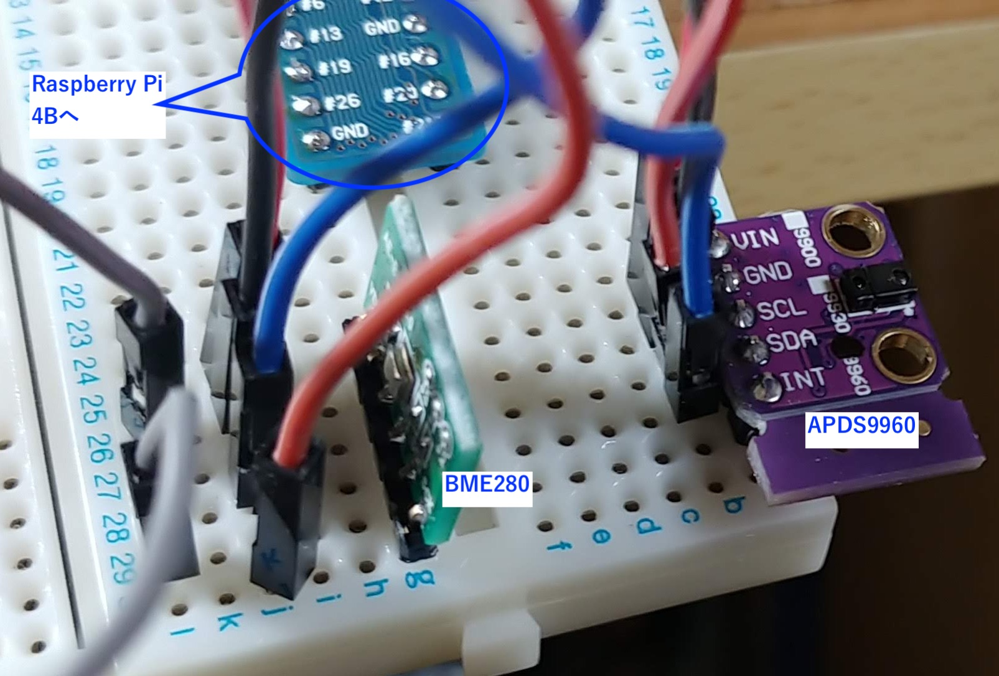

# his.RASP.i2c
 Python scrips for i2c sensors on Raspberry Pi

## 概要
   APDS9660使用 光学式ジェスチャーセンサモジュールキットと
   BME280使用　温湿度・気圧センサモジュールキットを
   Rapberry pi 4Bのi2cにバス繋いでみた。

## 接続概要図
    ラズパイ4Bは、放熱のためにアルミ合金ケースに入れているが、GPIO(40pin)はフラットケーブルで
    ケース外に引き出すことができる。
    そこからブレッドボードに繋いでセンサーモジュールを接続してみた。

	
	

## 接続確認
<pre>
# apt install i2c-tools
# i2cdetect -y 1

         0  1  2  3  4  5  6  7  8  9  a  b  c  d  e  f
    00:          -- -- -- -- -- -- -- -- -- -- -- -- --
    10: -- -- -- -- -- -- -- -- -- -- -- -- -- -- -- --
    20: -- -- -- -- -- -- -- -- -- -- -- -- -- -- -- --
    30: -- -- -- -- -- -- -- -- -- 39 -- -- -- -- -- --
    40: -- -- -- -- -- -- -- -- -- -- -- -- -- -- -- --
    50: -- -- -- -- -- -- -- -- -- -- -- -- -- -- -- --
    60: -- -- -- -- -- -- -- -- -- -- -- -- -- -- -- --
    70: -- -- -- -- -- -- 76 --              
</pre>
    0x39がAPDS9660
    0x76がBME280

とりあえず、認識されているようだ。

## 前提ソフトウエアのインストール

    # apt install python3-smbus python3-pip
    # python3 -m pip install apds9960
    # python3 -m pip install  RPi.GPIO

## 実行結果
    下記１行を標準出力に出して終わる。
<pre>
    { place : "home" ,  time : "2020-08-02T11:58:17Z" ,  "AmbientLight" : 151 ,  "red" :33 ,  "green" :28 ,  "blue" :26 }
</pre>

## 今後の予定
    crontabで10分ごとに動作させて、ファイルにためておく。
    node.jsとmongoDBで作ったサービスに結果を登録し、Chart.jsなどでグラフ化する。
    もともとAPDS9660はジェスチャーセンサーなんだが、その機能は使う予定なし。
